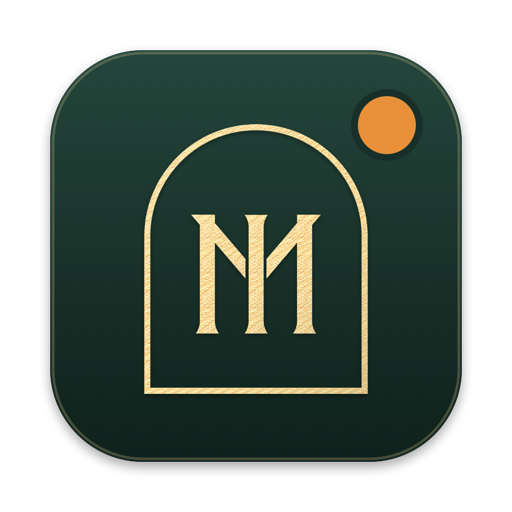
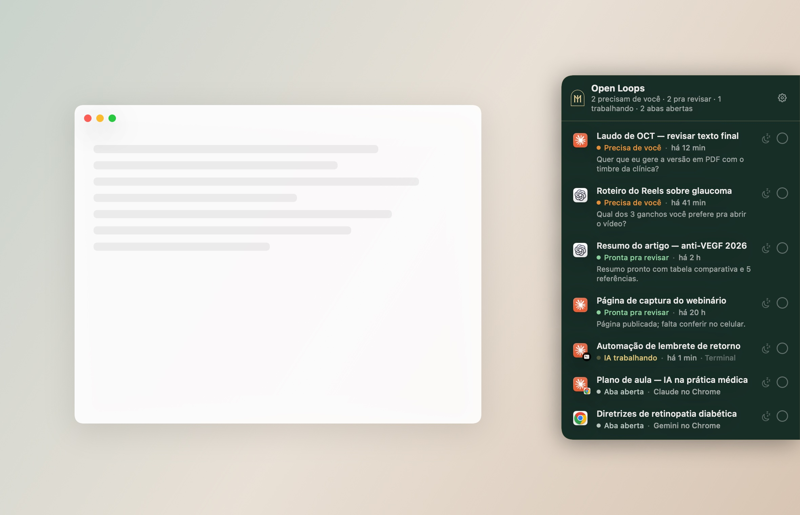
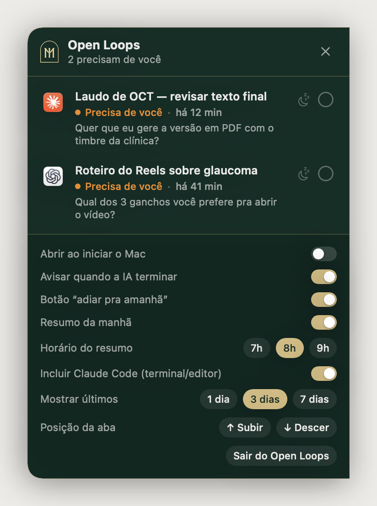

<p align="center"></p>

<h1 align="center">Open Loops</h1>

<p align="center"><b>A to-do list das suas conversas de IA.</b><br>
Uma abinha na borda da tela do Mac mostra quais conversas do Claude, do ChatGPT e do Chrome ficaram paradas esperando você.</p>

<p align="center"></p>

Você abre várias conversas de IA ao mesmo tempo: duas no Claude, três no ChatGPT, uma aba no Gemini… e no dia seguinte não lembra onde parou. O Open Loops lê essas conversas no seu Mac e mostra, numa lista só, o que ficou em aberto.

## O que ele mostra

| Status | Significado |
|---|---|
| 🟠 **Precisa de você** | A IA perguntou algo, está esperando uma decisão, parou no meio ou foi interrompida |
| 🟢 **Pronta pra revisar** | A IA terminou; falta você conferir |
| 🟡 **IA trabalhando** | Ainda está rodando |
| ⚪ **Aba aberta** | Conversa de IA aberta numa aba do Chrome |

- **Título** — o mesmo da barra lateral de cada app, e atualiza sozinho conforme a conversa avança.
- **O que falta** — o resumo que o Claude escreve no fim de cada resposta, ou a última frase da IA.
- **Clique** — abre exatamente aquela conversa (no Claude, no ChatGPT, na aba do Chrome, no terminal ou no editor).
- **✓** — tira da lista; se a conversa tiver atividade nova, ela volta sozinha.
- **🌙 Adiar pra amanhã** — some até a manhã seguinte, sem marcar como feita.

## Fontes

| De onde | Como lê |
|---|---|
| **Claude** (app do Mac, sessões do Code) | `~/Library/Application Support/Claude/claude-code-sessions` + `~/.claude/projects` |
| **Claude Code** no terminal ou no editor (VS Code, Antigravity, Cursor…) | `~/.claude/projects/*.jsonl` |
| **ChatGPT** (app do Mac) | `~/.codex/state_*.sqlite` + `~/.codex/sessions` |
| **Chrome** | abas de chatgpt.com, claude.ai, gemini.google.com, AI Studio, NotebookLM, Perplexity, Grok e DeepSeek (via AppleScript) |

**Privacidade:** o Open Loops só **lê** arquivos que já estão no seu Mac. Ele não altera nada nos outros apps, não pede login e não envia nada pra internet. O que você marca como feito fica em `~/Library/Application Support/OpenLoops/`.

**Limitação:** as conversas de chat comum do app do Claude (fora do Code) ficam só no servidor. Elas aparecem quando estão abertas numa aba do Chrome.

## Configurações (⚙︎ no painel)



Tudo liga e desliga:

- Abrir ao iniciar o Mac
- **Avisar quando a IA terminar** — a aba pulsa e chega uma notificação do macOS
- Botão **“adiar pra amanhã”**
- **Resumo da manhã** — notificação às 7h, 8h ou 9h com o que ficou parado (se o Mac estiver dormindo, chega quando ele acordar)
- Incluir **Claude Code** do terminal/editor
- Período mostrado: 1, 3 ou 7 dias
- Posição da aba na borda

<br clear="right">

## Instalar

### Jeito mais fácil: peça pra sua IA

Cole este prompt numa IA que roda comandos no seu Mac (**Claude Code** na aba Code do app do Claude, **Codex** no app do ChatGPT, Cursor ou Antigravity). O chat comum do claude.ai ou do chatgpt.com não tem acesso ao computador.

```text
Instale pra mim o app Open Loops a partir do código oficial no GitHub:
https://github.com/juliooandradee/open-loops

1. Confira se este Mac tem macOS 14 (Sonoma) ou mais novo.
2. Veja se o Swift está instalado (swift --version). Se não estiver, rode xcode-select --install, me avise e espere eu concluir a janela de instalação da Apple.
3. Clone o repositório numa pasta temporária e rode ./scripts/install.sh — ele compila o app e instala em ~/Applications.
4. Não instale nenhum outro programa, pacote ou dependência e não mexa em nada além disso.
5. No fim, confirme que o Open Loops abriu e me lembre de aceitar os pedidos de permissão do Chrome e das notificações.
```

Compilado no seu próprio Mac, o app abre sem o aviso de “desenvolvedor não identificado”.

### Baixar o app pronto

1. Baixe o `Open-Loops.zip` na página de [Releases](../../releases/latest) e arraste o **Open Loops** pra pasta **Aplicativos**.
2. Na primeira vez, o macOS avisa que o app é de um desenvolvedor não identificado (ele não é assinado pela Apple). Vá em **Ajustes do Sistema › Privacidade e Segurança** e clique em **Abrir Mesmo Assim**.
3. Quando o macOS pedir, permita que o Open Loops controle o **Google Chrome** (só pra listar as abas de IA) e mande **notificações**.

Requisitos: macOS 14 (Sonoma) ou mais novo. Funciona em Apple Silicon e Intel.

### Compilar do código

```bash
git clone https://github.com/juliooandradee/open-loops.git
cd open-loops
./scripts/install.sh
```

Precisa só das Command Line Tools do Xcode (`xcode-select --install`). Não tem dependências externas.

## Estrutura

```
Sources/OpenLoops/
  main.swift                  app sem ícone no Dock
  SidePanelController.swift   faixa na borda da tela, hover e animação
  Views.swift / SettingsView.swift   interface (SwiftUI)
  TaskStore.swift             junta as fontes, avisos, adiar, resumo da manhã
  ClaudeSource.swift          sessões do app do Claude
  ClaudeCodeCLISource.swift   Claude Code no terminal/editor
  ClaudeTranscript.swift      leitura das transcrições do Claude Code
  CodexSource.swift           conversas do app do ChatGPT
  ChromeSource.swift          abas de IA no Chrome
  HiddenTaskStore.swift       conversas feitas/adiadas
  Notifier.swift              notificações do macOS
scripts/
  build.sh / install.sh       compila (universal) e instala em ~/Applications
  make-icon.swift             gera o ícone
```

## Créditos

Feito por **Júlio Andrade** pra [Comunidade IA para Médicos](https://comunidadeiamedicos.com) · MED Magno. A ideia da abinha na borda da tela veio do [Codenotch](https://github.com/vinzdg/codenotch), que mostra o uso de limite das ferramentas de IA.

Código sob licença [MIT](LICENSE). O emblema MED Magno é marca do Instituto Magno e não está coberto pela licença MIT.
